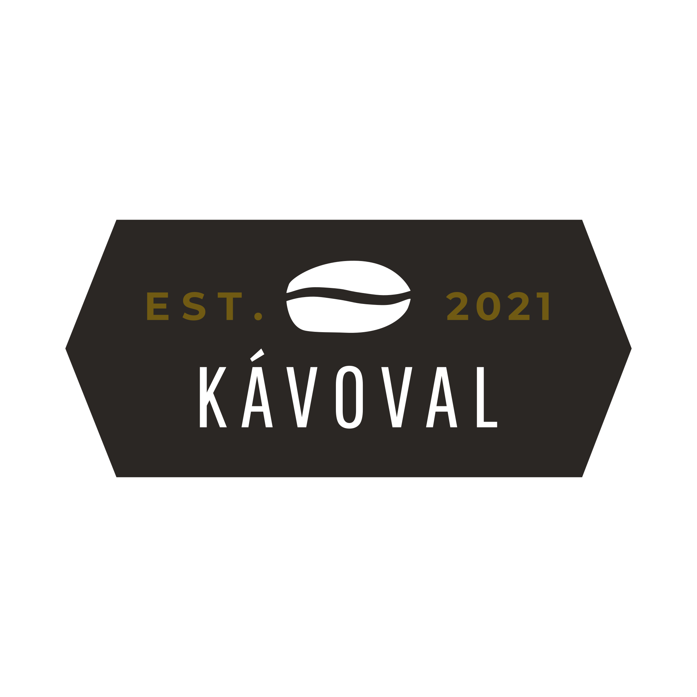
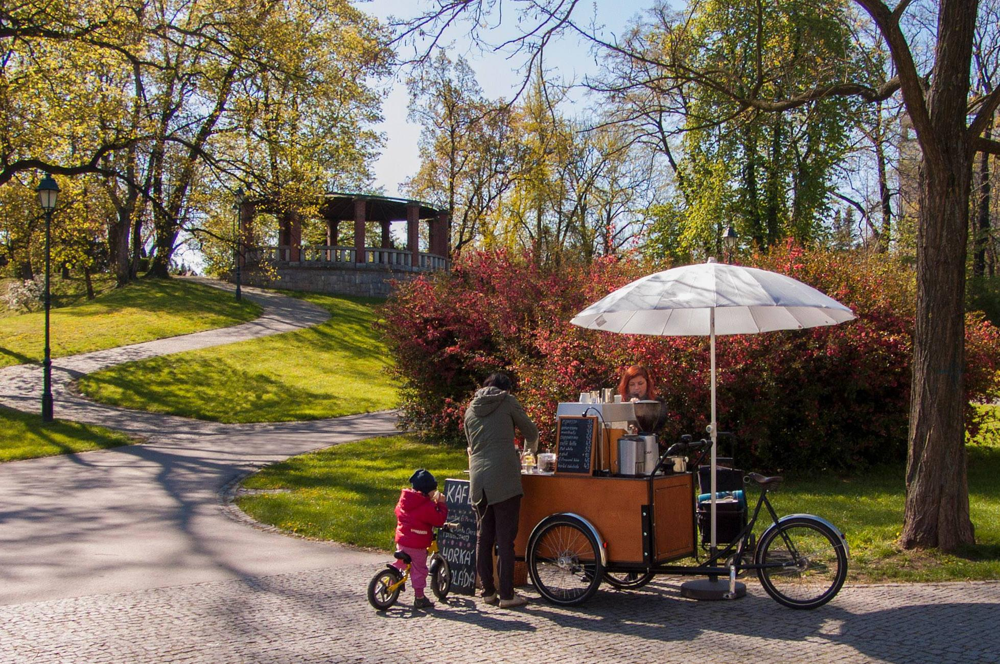

<header>
# Kávoval

#### Tomáš Dostál, EMP cvičení C301
#### 21.5.2021
  
  
  
 
 
 
</header>
<main>

# Obsah

1. [Úvod](#uvod)
2. [Účel, shrnutí](#ucel)
    1. [Aktiální situace na trhu](#situace-na-trhu)
    2. [Poskytované produkty](#produkty)

3. [Another paragraph](#paragraph2)

# Úvod 

Kafe není nikdy dost. Zejména toho dobrého. Tento podnikatelský plán se věnuje pojizdné kavárně *kávoval*, která má dva jednoduché cíle: 
- dělat lidi šťastnějšími a povzbudit je do nového dne a zároveň 
- pomoci se socializací programátorům

Jak toho ale docílit? 

Recept na první část je relativně jednoduchý. Kvalitní kávové boby, namleté na místě, čerstvá smetana či plnotučné mléko. Třtikový cukřík na nervy, povzbudivý citát na kelímek a extra porce úsměvu. To je něco, co zlepší den každému milovníkovi dobré kávy. Druhá část je trošku komplikovanější a to socializovat jinak nepříliš sociální sortu lidí. O to to je ale zajímavější cíl. 

Předmětem podnikatelského plánu bude prodej kávy v pojizdné provozovně. To s sebou nese množství nevýhod, jako třeba potřeba vlastních zdrojů energie, vody, nebo závislost na počasí, ale i spoustu výhod. Mezi nimi ja například možnost dojet přímo za zákazníky a díky toho prodávat i na frekventovaných místech, kde by byl jinak vysoký nájem, práce na čerstvém vzduchu. Cílem nicméně není v prvé řadě zisk, ale spíšezajištění rutinní ruční práce, která je spojená s komunikací s lidmi, která je na hony vzdálená běžné práci programátora. 

# Účel, shrnutí 

Jedná se o podnikatelský plán pro případné investory. Projekt se nicméně obejde v minimální konfiguraci i bez nich a to za pomoci úvěru. Hned ze začátku tedy existují dva plány: 
- s přispěním investora, 
- bez přispění investora 

## Aktuální situace na trhu 

V oblasti pohostinství díky/kvůli pandemii COVID-19 skončilo nemalé množství podniků. To otvírá díru na trhu, jakmile dojde k výraznějšímu rozvolnění opatření a/nebo dostatečnému promoření/proočkování populace. Úspechu také napovídá dlouhodobě zvyšující se tendence Čechů pít kávu jinde, než doma. Z krátkodobého hlediska hraje jistou roli i menší tolerance k novým omezujícím nařízením. Nevím, nakolik sem takové odvážné tvrzení patří, ale lidé už jsou z protiepidemiologických opatření unavení a chtějí si od nich odpočinout. 

## Jaké produkty budeme poskytovat? 

Budeme nabízet široké spektrum káv od tradičního espressa přes cappucino až po chuťovky jako alžírská káva připravovaných na místě. Chceme vyhovět co nejvíce zákazníkům, proto budeme nabízet varianty s bezlaktózovým mlékem, sójovým mlékem i bezkofeinové. Abychom zredukovali množství odpadu z jednorázového nádobí, budeme se snažit zákazníky motivovat výraznější slevou, aby si nosili vlastní kelímky, či hrnečky. 

## Jaká je konkurenční výhoda? <a name="konkurencni-vyhoda</a>

Konkurenční výhodou bude kvalita a mobilita prodejny. Budeme se moci přesouvat dle období a případně i dle koncentrace lidí, dovolí-li to možnosti pro místa prodeje. Kromě toho během pandemie COVID-19 zkrachovalo/zavřelo nemalé množství podniků v pohostinství, což po skončení pandemie, nebo alespoň výraznějšímu rozvolnění opatření, otevře možnost novým podnikům, jako bude *kávoval*. Za konkurenční výhodu lze považovat také strategicky vybranou lokaci podniku v závislosti na čase (o tom pozdeji) 

## Jaké produkty budeme poskytovat? 

Myšlěnkou je prodávat kávu v jezdící kavárně. 

# Popis podnikatelské činnosti – volba formy podnikání 

Pro provoz této činnosti bude třeba získat živnostenský list na provozování hostinské činnosti, nebo alespoň sehnat někoho, kdo živnost zaštítí. V tomto bodě spoléhám na známého, který vedl dlouhou dobu hospodu. 

- Vlastnická struktura: Bude poměrně přímočará, ze začátku plánuji podnikat na živnostenský list a budu jediným vlastníkem a jediným zaměstnancem. Později, aby projekt nabyl svého druhého cíle - socializace (dalších) programátorů, dojde pravděpodobně k založení s.r.o.

- Popis podnikatelské činnosti: Jak již bylo nastíněno, bude se jednat o prodej kávy v mobilním stánku. 

Primárním cílem je nabízet kvalitní kávu za férovou cenu. Cílem nemusí být nutně nějaký velký zisk, postačující bude porkytí nákladů. Myšlenkou je spíše najít práci, která by mne bavila, ikdyby to znamenalo spokojit se s nižším výdělkem. 

# Analýza potenciálních trhů (zákazníků)

Na základě dotazníkového šetření z [1](https://theses.cz/id/cb9e9q/21354261), kde z 240 respondentů odpovědělo 83 osob (34% z celkového počtu dotázaných), že pijí kávu v kavárnách, či cukrárnách, což není zanedbatelné procento a bude naší cílovou skupinou. Zároveň odsud vyplývá, že přijatelná cena za kávu je pro 93.6% do 50Kč. 

Z charakteru podnikání je jasné, že kavárna bude vyjíždět jen, když bude teplo a dobré počasí, což nám dává přibližně období od května po září. Také mne bude limitovat počasí, protože v dešti si zákazníci užijí dobrou kávu raději z pohodlí kavárny a ne na ulici, či v parku. 

Lidé ve věku do 26 let se mají tendence sdružovat poblíž vzdělávacích institucí. Vcelku zajímavou cílovou skupinou jsou vysokoškoláci, u kterých jsou již jisté předpoklady, že kávu, či jiné povzbudivé nápoje konzumují. Více v sekci [Vhodná umístění](#vhodna-umisteni). Jako vhodná doba pro tuto cílovou skupinu je konec semestru, kdy už bývá venkovní teplota mnohdy celkem přijatelná, Tato skupina je nicméně vemi lákavou zejména vběhem zkouškového období poblíž NTK.

Po skončení zkouškového období by se pojizdná kavárna přesunula na jiné, třeba i méně frekventované místo. Vhodnými kandidáty jsou například park Stromovka, či Letenské sady, ze kterých je nádherný výhled na Prahu. Možností je mnoho, nicméně v tomto plánu jsem se rozhodl jako druhou možnost stanovat park v Letenských sadech, protože se v něm rád procházím... Nebo jsem se aspoň rád procháhzel, když jsem ještě bydlel v Praze. 

# Analýza konkurence

Konkurence bude záviset na místě, kde se pohyblivá kavárna zrovna bude nacházet. Naneštěstí současná doba numožňuje detailní analýzu konkurence, jelikož jsou provozovny zavřené, ve většině případů nemají ani webové stránky a když už je mají, tak na nich nápojové lístky buď vůbec nejsou, nebo jsou těžce neaktuální. Při hledání jsem mnohdy narazil na fotky nápojových lístků několik let starých. 

# Lokace 1 - Kapmus Dejvice, poblíž NTK 

[mapa Dejvice](./img/dejvice_ocislovane.png)

| Číslo na mapě | Název provozovny | Typ provozovny | Je to reálná konkurence? | Poznámka                                     |
|---------------|------------------|----------------|--------------------|----------------------------------------------------------------| 
| 1             | FEL Caffé        | Bufet          | Spíše ano          | Bližší informace se mi na webu nepodařilo nalézt |
| 2             | Cafe Prostoru_   | Pivnice-kavárna | Ano        | Sídlí přímo v budově NTK, což z ní dělá velkou konkurenci (studenti to tam mají z NTK blíž). | 
| 3             | Kantor Coffee    | Kavárna        | Ano                | V budově fakulty Stavební, cena kávy (co pamatuji) OK, příjemné prostředí. Web mimo provoz, nemohu srovnat dle aktuálního ceníku | 
| 4             | Archicafe ČVUT | Kavárna          | Ano                | Nikdy jsem tam nebyl, na webu chybí ceník. Konkurence to nicméně bude. |
| 5             | Café Masaryk     | Kavárna        | Ne            | Nemá web, žádné inforamce o kavárně nejdou dohledat, nemá žádné recenze. Pravděpodobně již nějakou dobu uzavřená. |
| 6             | Restaurant & Café Blox | Restaurace | Spíše ne  | Ceny nižší (dle ceníku na webu, ten se ale tváří být zastaralý), malá nabídka. Spíše restaurace |
| 7             | Cafe Šesťák      | Kavárna        | Ano	   | Ceny jsou srovnatelné s nabídkou Kávoval. Kvalitně zpracované webové stránky |
| 8             | Cafe Perfect day | Restaurace        | Spíše ano    | Od kapmusu Dejvice již dále, dražší podnik, spíše se specializuje na jídlo |
| 9             | Kavárna Nahoře a dole | Kavárna   | Ne     |  Pravděpodobně zavřeno, na sociálních sítích žádná aktivita v posledních 7mi letech, domána je zaperkovaná |

## Restaurant & Café Blox (6) 
| Produkt | #6 Restaurant & Café Blox [zdroj](https://www.blox-restaurant.cz/#!/page_bistro_napoje) (Kč) | Kávoval odhadovaná cena (Kč) | % rozdíl cen |
|---------|--------------------------|-------------------------|-------|
| Espresso | 35,- | 44,- | +25% |
| Espresso dopio | ??? | 54,- | ??? |
| Cappucino | 40,- | 59,- | +47% |
| Café latté |  45,- | 59,- | +31% |
| Flat white | ??? | 69,- |  ??? |
| Espresso machiato | ??? | 54,- | ??? |
| Alžírská káva | ??? | 79,- | ??? |

Patrně se jedná spíše o restauraci, než kavárnu. Jejich nabídka je poměrně slabá a soudě podle stránek je delší dobu neaktualizovaná. 

## Cafe Šesťák  (7) 

| Produkt | #7  Cafe Šesťák  [zdroj](https://cafesestak.cz/) (Kč) | Kávoval odhadovaná cena (Kč) | % rozdíl cen |
|---------|--------------------------|-------------------------|-------|
| Espresso | 45,- | 44,- | -3% |
| Espresso dopio | 55,- | 54,- | -2% |
| Cappucino | 56,- | 59,- | +5% |
| Café latté |  56,- | 59,- | +5% |
| Flat white | 65,- | 69,- |  +6% |
| Espresso machiato | 52,- | 54,- | +4% |
| Alžírská káva | ??? | 79,- | ??? |

## Cafe Perfect day (8)

| Produkt | #8 Cafe Perfect day  [zdroj](https://www.cafeperfectday.cz/menu/) (Kč) | Kávoval odhadovaná cena (Kč) | % rozdíl cen |
|---------|--------------------------|-------------------------|-------|
| Espresso | 45,- | 44,- | -3% |
| Espresso dopio | 75,- | 54,- | -28% |
| Cappucino | 60,- | 59,- | -2% |
| Café latté |  75,- | 59,- |  -21% |
| Flat white | 70,- | 69,- |  -2% |
| Espresso machiato | 45,- | 54,- | +20% |
| Alžírská káva | 115,-| 79,- | -31% |

Kromě tohoto jsem se rozhodl srovnat projekt i s obdobným z mého rodného města, Opavy. Dlužno dodat, že Opava je 60ti tisícové město.  

## MámaMeleKafe (Opava)  

 
[Zdroj](https://www.firmy.cz/detail/12899142-mama-mele-kafe-opava.html) 

- otevírací doba 7-18h, víkendy 10-17h
- Mají zázemí kamenné prodejny, kousek od místa, kde prodávají kávu s kolem
- Mají jedno trvalé místo, kde s kolem parkují

| Produkt | MámaMeleKafe cena (2018) [zdroj](https://www.foodyas.com/CZ/Opava/424407117699861/M%C3%A1ma-mele-kafe) (Kč) | Kávoval odhadovaná cena (Kč) | % rozdíl cen |
|---------|--------------------------|-------------------------|-------|
| Espresso | 38,- | 44,- | +15% |
| Espresso dopio | 48,- | 54,- | +12% |
| Cappucino | 45,- | 59,- | +31% |
| Café latté |  48,- | 59,- | +21% |
| Flat white | 55,- | 69,- | +25% |
| Espresso machiato | ??? | 54,- | ??? |
| Alžírská káva | ??? | 79,- | ??? |

# Lokace 2 - Park Letná

Je zde nádherný výhled na Prahu a v nejvližším okolí není výrazná konkurence. Optimální by bylo mít nějaká lehátka a nechat zákazníky si na nich posedět. Je tam nicméně dost laviček. 
[mapa Dejvice](./img/letna_ocislovane.png)

| Číslo na mapě | Název provozovny | Typ provozovny | Je to reálná konkurence? | Poznámka                                 |
|---------------|------------------|----------------|--------------------|-----------------------------------------------------------------| 
| 1             | Cafe pointa      | Bufet          | Spíše ano          | Spustředí se spíše na jídlo, káva je vedlejší produkt |
| 2             | Literární kavárna   | Prodejna knih | Spíše ne       | Podle všeho se jedná spíše o prodejnu knih / eshop s knihami | 

## Cafe pointa (1) 
| Produkt | #1 Cafe pointa  [zdroj](http://cafepointa.cz/) (Kč) | Kávoval odhadovaná cena (Kč) | % rozdíl cen |
|---------|--------------------------|-------------------------|-------|
| Espresso | 45	,- | 44,- | -3% |
| Espresso dopio | 65,-| 54,- | -17% |
| Cappucino | 60,- | 59,- | -1% |
| Café latté |  70,- | 59,- | -15% |
| Flat white | 75,- | 69,- | -9% |
| Espresso machiato | ??? | 54,- | ??? |
| Alžírská káva | ??? | 79,- | ??? |

Patrně se jedná spíše o restauraci, než kavárnu. Jejich nabídka je poměrně slabá a soudě podle stránek je delší dobu neaktualizovaná. 

# Marketingová a obchodní strategie (konkurenční výhoda)

Projekt nenabízí žádné výraznější obchodní výhody. Protože nejde až tak moc o zisk, jako spíše o získání práce, která se dělá rukama. Jak bylo popsáno v analýze konkurence, Kávoval nabízí více méně srovnatelné (a někdy i nižší) ceny  na Pražské poměry. 

# Realizační projektový plán

Časový harmonogram
# Finanční plán

## 
 (odhad budoucích výnosů, nákladů)
# Předpoklady úspěšnosti, analýza rizik (SWOT analýza)
Přílohy
</main>
